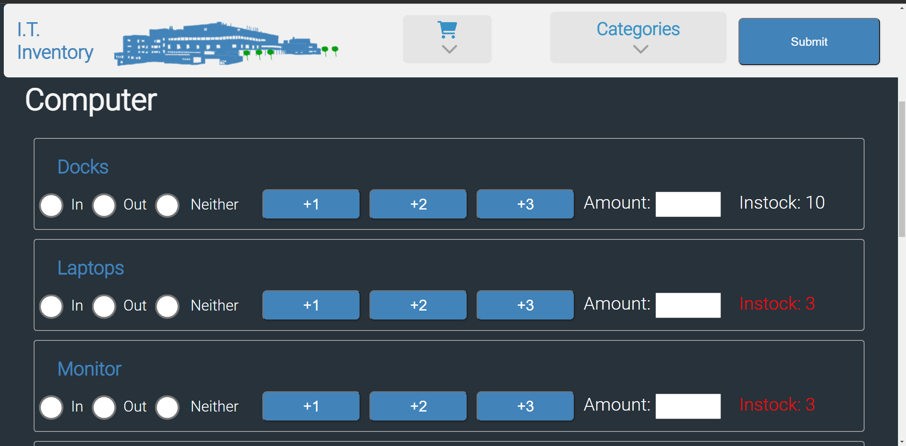
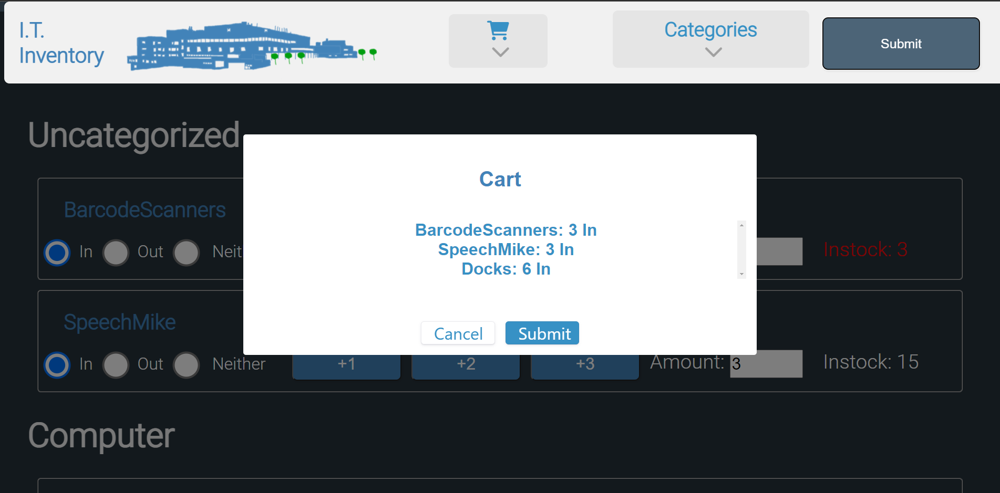

# Asset Management Webpage
An inventory management system created for PRHC IT team by Connor Pink, Connor Millson, and Jax Sutton.
## Info

Database 'storage' contains a 'log' table which holds transaction data for all input and output done on the table so that you can track the total amount of items as it changes over time.

The sendemail table contains the last time that a low-stock email was sent out for each item, this is so that the emails are only sent out every 3 days as long as the stock level is below the threshold.

The 'inventory' table contains all the items that will be tracked. each item is given a stock level, catagory, and threshold. The item can only have 1 category and all items of the same category will be grouped together. The threshold is the stock level at which an email will be sent to the email list reminding them that the stock level is too low. So if stock level is less than threshold -> send email and change stock color to red. If stock level is within 1.5 x threshold change stock color to orange.

Information on setting up this program is on the wiki page.

___
## Screenshots
### Homepage

### Submit Cart

